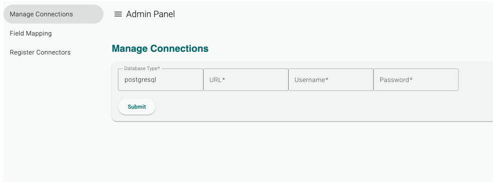
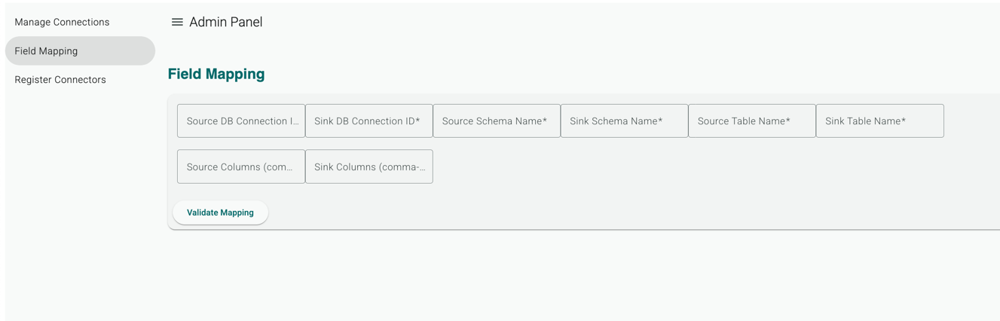
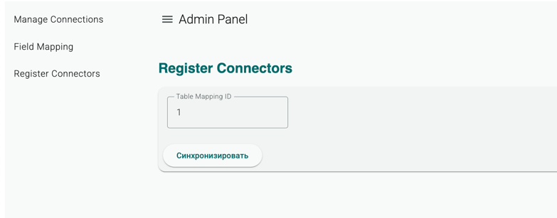

# 1. Quick start

1. локально поднимите сервисы

```bash
docker compose up
```

2. После запустите приложение из класса Main (зеленая стрелка запуска в IDEA)
3. После можно вызывать АПИ которые есть в сервисе. Контракты описаны ниже

--- 

# 2. Schema explorer REST API

## 1. Зарегистрировать connection string к базе данных (сохранить у себя логин и пароль для подключения к БД)
- Пункт 1. SourceDbConnectionId
```bash
curl --location 'http://localhost:8081/datasource/connection/add' \
--header 'Content-Type: application/json' \
--data '{
    "dbType": "postgresql",
    "url": "jdbc:postgresql://localhost:5432/source_db",
    "username": "user1",
    "password": "user1pwd",
    "isActive": "true"
}'
```
response:
```json
{
    "id": 1,
    "dbType": "postgresql",
    "url": "jdbc:postgresql://localhost:5432/source_db",
    "username": "user1",
    "password": "user1pwd",
    "isActive": true,
    "datasourceType": null
}
```
- в других АПИ используем этот id (aka datasourceConnectionId) чтобы получить информацию о списке таблиц
- `{source,sink}DbConnectionId` при маппинге полей с одной БД в другую берутся отсюда
- Пункт 2. Не забудьте зарегистрировать sinkDbConnectionId 



## 2. Получить список таблиц по connectionId
```bash
curl --location 'http://localhost:8081/datasource/connection/metadata/info?datasourceConnectionId=1'
```
response: 
```json
{
    "public": {
        "books": [
            {
                "name": "id",
                "type": "bigint",
                "isNullable": "NO"
            },
            {
                "name": "title",
                "type": "text",
                "isNullable": "NO"
            },
            {
                "name": "author",
                "type": "text",
                "isNullable": "NO"
            },
            {
                "name": "published_year",
                "type": "integer",
                "isNullable": "YES"
            }
        ]
    }
}
```

```bash
curl --location 'http://localhost:8081/datasource/connection/add' \
--header 'Content-Type: application/json' \
--data '{
    "dbType": "postgresql",
    "url": "jdbc:postgresql://localhost:5432/sink_db",
    "username": "user2",
    "password": "user2pwd",
    "isActive": "true"
}'
```

## 3. Зарегистрировать маппинг полей из source в sink
- описывает каким образом мы хотим сопоставить поля из источника в целевую БД
- `sourceDbConnectionId` - идентификатор подключения к БД источнику. Данный id берется при добавлении нового коннекта из `/datasource/connection/add`
- `sinkDbConnectionId` - идентификатор подключения к целевой БД. Данный id берется при добавлении нового коннекта из `/datasource/connection/add`
- `sourceColumnsList` - список столбцов который берется из БД источника для трансфера. Порядок важен
- `sinkColumnsList` - сопоставленный к sourceColumnsList список столбцов, из целевой БД. Порядок важен
- `transformations` - еще не готово. Применяемые преобразования на лету.

```bash
curl --location 'http://localhost:8081/datasource/connection/register/table-mapping' \
--header 'Content-Type: application/json' \
--data '{
  "sourceDbConnectionId": 1,
  "sinkDbConnectionId": 2,
  "sourceSchemaName": "public",
  "sinkSchemaName": "public",
  "sourceTableName": "books",
  "sinkTableName": "books",
  "sourceColumnsList": ["id", "title", "author"],
  "sinkColumnsList": ["id", "title", "author"],
  "transformations": null
}
'
```
resposne:
```json
{
    "id": 1,
    "sourceDbConnectionId": 1,
    "sinkDbConnectionId": 2,
    "sourceSchemaName": "public",
    "sinkSchemaName": "public",
    "sourceTable": "books",
    "sinkTable": "books",
    "sourceToSinkColumnNameMapping": {
        "author": "author",
        "id": "id",
        "title": "title"
    },
    "transformations": null
}
```

Данные о сопоставленных полях хранятся в таблице `table_mapping`



# 4. Регистрация коннекторов 



### 4.1 Для регистрации Source коннектора:

```bash
curl --location --request POST 'http://localhost:8081/connectors/register/source?tableMappingId=1'
```

### 4.2 Для регистрации Sink коннектора:

```bash
curl --location --request POST 'http://localhost:8081/connectors/register/sink?tableMappingId=1'
```

# Авторизация на проекте

```bash
curl --location 'http://localhost:7080/realms/amvera/protocol/openid-connect/token' \
--header 'Content-Type: application/x-www-form-urlencoded' \
--data-urlencode 'client_id=cdc-client1' \
--data-urlencode 'client_secret=2DdrcgHnkcruLsUTo2ltNzm1iu5nddR7' \
--data-urlencode 'username=cdc-user1' \
--data-urlencode 'password=user1pass' \
--data-urlencode 'grant_type=password'
```


response

```json
{
    "access_token": "..",
    "expires_in": 300,
    "refresh_expires_in": 1800,
    "refresh_token": "..",
    "token_type": "Bearer",
    "not-before-policy": 0,
    "session_state": "8f0e9e3b-d3d4-499d-a5b1-a5b1587a075a",
    "scope": "email profile"
}
```
