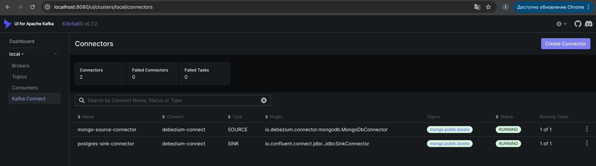
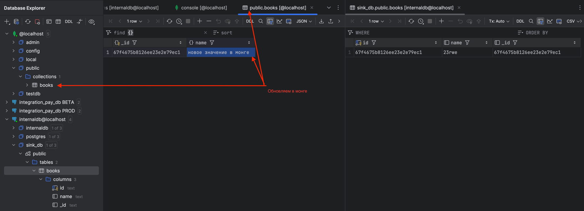
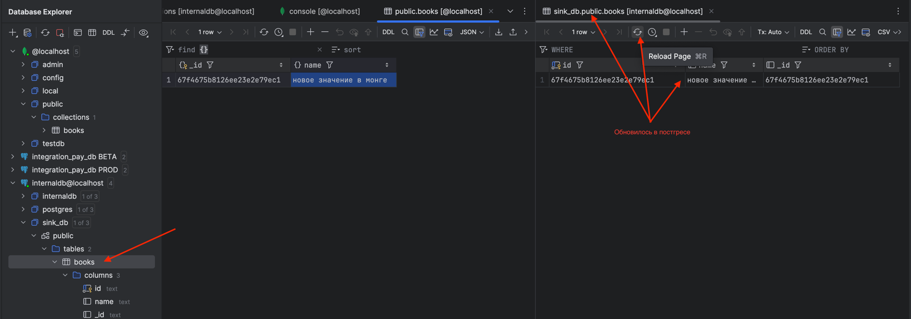

```bash
curl -X POST -H "Content-Type: application/json" \
     --data @mongo-source.json \
     http://localhost:8083/connectors
```


```bash
curl -X POST -H "Content-Type: application/json" \
     --data @postgres-sink.json \
     http://localhost:8083/connectors
```


```bash
curl -X DELETE http://localhost:8083/connectors/mongo-source-connector
```


```bash
curl -X DELETE http://localhost:8083/connectors/postgres-sink-connector
```


поднимает коннекторы из рабочего варианта




ФОРМАТ СООБЩЕНИЯ

```json
{
	"schema": {
		"type": "struct",
		"fields": [
			{
				"type": "string",
				"optional": true,
				"name": "io.debezium.data.Json",
				"version": 1,
				"field": "before"
			},
			{
				"type": "string",
				"optional": true,
				"name": "io.debezium.data.Json",
				"version": 1,
				"field": "after"
			},
			{
				"type": "struct",
				"fields": [
					{
						"type": "array",
						"items": {
							"type": "string",
							"optional": false
						},
						"optional": true,
						"field": "removedFields"
					},
					{
						"type": "string",
						"optional": true,
						"name": "io.debezium.data.Json",
						"version": 1,
						"field": "updatedFields"
					},
					{
						"type": "array",
						"items": {
							"type": "struct",
							"fields": [
								{
									"type": "string",
									"optional": false,
									"field": "field"
								},
								{
									"type": "int32",
									"optional": false,
									"field": "size"
								}
							],
							"optional": false,
							"name": "io.debezium.connector.mongodb.changestream.truncatedarray",
							"version": 1
						},
						"optional": true,
						"field": "truncatedArrays"
					}
				],
				"optional": true,
				"name": "io.debezium.connector.mongodb.changestream.updatedescription",
				"version": 1,
				"field": "updateDescription"
			},
			{
				"type": "struct",
				"fields": [
					{
						"type": "string",
						"optional": false,
						"field": "version"
					},
					{
						"type": "string",
						"optional": false,
						"field": "connector"
					},
					{
						"type": "string",
						"optional": false,
						"field": "name"
					},
					{
						"type": "int64",
						"optional": false,
						"field": "ts_ms"
					},
					{
						"type": "string",
						"optional": true,
						"name": "io.debezium.data.Enum",
						"version": 1,
						"parameters": {
							"allowed": "true,last,false,incremental"
						},
						"default": "false",
						"field": "snapshot"
					},
					{
						"type": "string",
						"optional": false,
						"field": "db"
					},
					{
						"type": "string",
						"optional": true,
						"field": "sequence"
					},
					{
						"type": "int64",
						"optional": true,
						"field": "ts_us"
					},
					{
						"type": "int64",
						"optional": true,
						"field": "ts_ns"
					},
					{
						"type": "string",
						"optional": false,
						"field": "collection"
					},
					{
						"type": "int32",
						"optional": false,
						"field": "ord"
					},
					{
						"type": "string",
						"optional": true,
						"field": "lsid"
					},
					{
						"type": "int64",
						"optional": true,
						"field": "txnNumber"
					},
					{
						"type": "int64",
						"optional": true,
						"field": "wallTime"
					}
				],
				"optional": false,
				"name": "io.debezium.connector.mongo.Source",
				"field": "source"
			},
			{
				"type": "string",
				"optional": true,
				"field": "op"
			},
			{
				"type": "int64",
				"optional": true,
				"field": "ts_ms"
			},
			{
				"type": "struct",
				"fields": [
					{
						"type": "string",
						"optional": false,
						"field": "id"
					},
					{
						"type": "int64",
						"optional": false,
						"field": "total_order"
					},
					{
						"type": "int64",
						"optional": false,
						"field": "data_collection_order"
					}
				],
				"optional": true,
				"name": "event.block",
				"version": 1,
				"field": "transaction"
			}
		],
		"optional": false,
		"name": "mongo.public.books.Envelope"
	},
	"payload": {
		"before": null,
		"after": "{\"_id\": {\"$oid\": \"67f4675b8126ee23e2e79ec1\"},\"name\": \"23rwe\\n\"}",
		"updateDescription": {
			"removedFields": null,
			"updatedFields": "{\"name\": \"23rwe\\n\"}",
			"truncatedArrays": null
		},
		"source": {
			"version": "2.7.0.Final",
			"connector": "mongodb",
			"name": "mongo",
			"ts_ms": 1744070865000,
			"snapshot": "false",
			"db": "public",
			"sequence": null,
			"ts_us": 1744070865000000,
			"ts_ns": 1744070865000000000,
			"collection": "books",
			"ord": 1,
			"lsid": null,
			"txnNumber": null,
			"wallTime": 1744070865419
		},
		"op": "u",
		"ts_ms": 1744070865593,
		"transaction": null
	}
}
```

Обновляем в монге



CRUD применяется к постгресу


